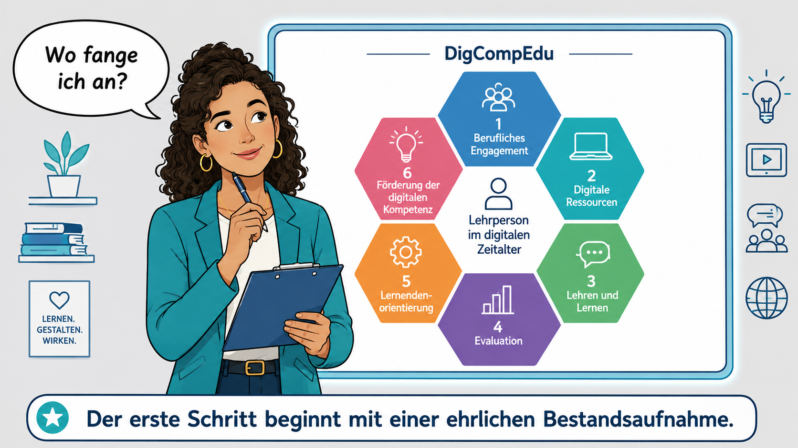
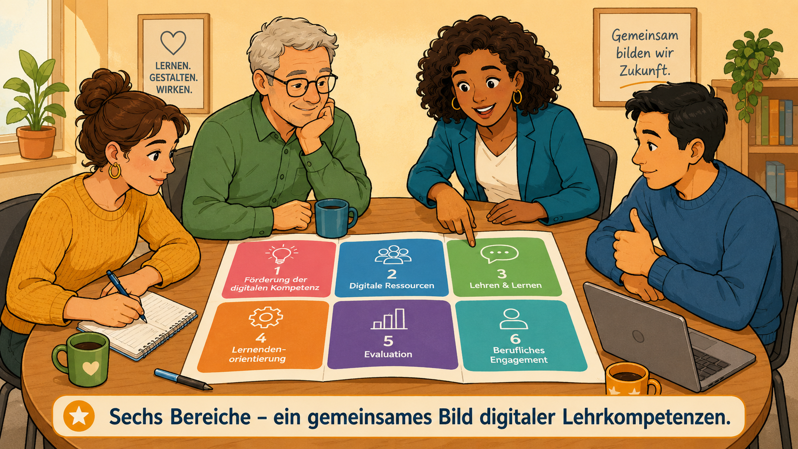
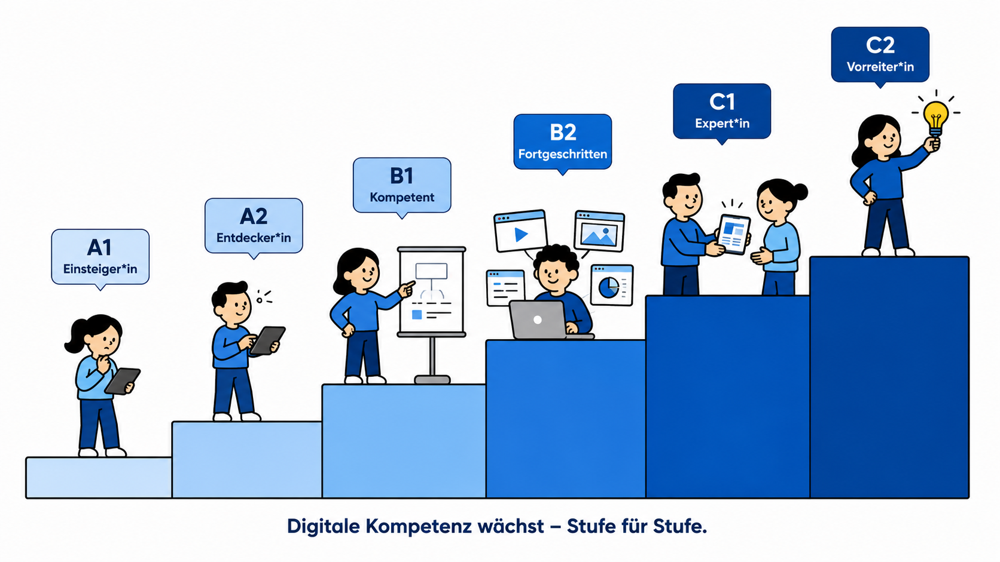
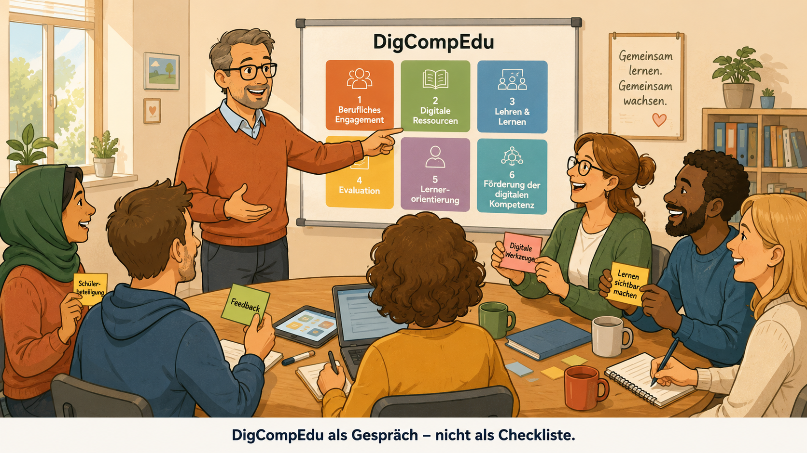

<!--
author: Stefan Hierholzer
email: 
version: 1.0
language: de
narrator: German Male

comment: Selbstlernkurs DigCompEdu – Europäischer Rahmen für die Digitale Kompetenz von Lehrenden.
         Für Schulleitungen und Lehrkräfte an Fachschulen für Sozialwesen und anderen Berufsschulen
         sowie Lehramtsstudierende und Referendar*innen. DQR Niveau 6.

logo: https://upload.wikimedia.org/wikipedia/commons/thumb/6/6c/JRC_DigCompEdu_framework_-_DE.png/800px-JRC_DigCompEdu_framework_-_DE.png

import: https://raw.githubusercontent.com/LiaScript/docs/master/README.md

link: https://fonts.googleapis.com/css2?family=Source+Sans+Pro:wght@300;400;600&display=swap
-->

# DigCompEdu: Europäischer Rahmen für die Digitale Kompetenz von Lehrenden

> **Ein Selbstlernkurs für Schulleitungen und Lehrkräfte an Fachschulen für Sozialwesen und anderen Berufsschulen sowie Lehramtsstudierende und Referendar\*innen**
---

## 📋 Kursübersicht

| Angabe | Information |
|--------|-------------|
| **Zielgruppe** | Schulleitungen an Fachschulen für Sozialwesen und anderen Berufsschulen; Lehrkräfte; Lehramtsstudierende (DQR 6); Referendar\*innen |
| **Zeitaufwand** | ca. 4–5 Stunden (selbstgesteuert, modular) |
| **Niveau** | DQR Stufe 6 (Bachelor-Äquivalenz) |
| **Format** | Selbstlernkurs mit Reflexionsphasen und Selbstüberprüfung |
| **Grundlagendokument** | Redecker, C. (2017). *European Framework for the Digital Competence of Educators: DigCompEdu*. Europäische Kommission. |

---

## 🎯 Kompetenzorientierte Lernziele (DQR 6)

Nach Abschluss dieses Kurses sind Sie in der Lage:

**Wissen und Verstehen**

1. Den DigCompEdu-Kompetenzrahmen in seiner Struktur (6 Bereiche, 22 Kompetenzen, 6 Niveaustufen) systematisch zu erklären und seinen Entstehungskontext in der europäischen Bildungspolitik zu verorten.
2. Die Niveaustufen A1–C2 auf der Grundlage bildungspolitischer Referenzdokumente (KMK 2021; Redecker 2017) zu beschreiben und zu differenzieren.

**Können – instrumentale und systemische Kompetenzen**

3. Das eigene Kompetenzprofil mithilfe des DigCompEdu CheckIn-Tools zu ermitteln, kritisch zu reflektieren und in Entwicklungsziele zu übersetzen.
4. Den DigCompEdu als Steuerungs- und Planungsinstrument für schulische Fortbildungsprozesse und Personalentwicklung einzusetzen.
5. Die Kompetenzfelder des DigCompEdu mit konkreten digitaldidaktischen Werkzeugen (z. B. Moodle, kollaborative Tools) zu verknüpfen und deren Einsatz pädagogisch zu begründen.

**Können – kommunikative und soziale Kompetenzen**

6. Digitale Entwicklungsprozesse im Kollegium auf Basis des DigCompEdu moderieren und kollegiale Selbstreflexionsprozesse anleiten.

---

## ⏱️ Zeitplanung

```ascii
Modul 0: Einstieg & Standortbestimmung         30 min
Modul 1: Entstehung & Einbettung               40 min
Modul 2: Die 6 Kompetenzbereiche               70 min
Modul 3: Die 6 Niveaustufen & Progression      50 min
Modul 4: DigCompEdu im schulischen Alltag      60 min
Modul 5: DigCompEdu & Lernende Organisation    40 min
Abschluss: Gesamtreflexion & Transfer          30 min
────────────────────────────────────────────────────
Gesamt:                               ca. 4–5 Stunden
```

---

## Modul 0: Einstieg – Wo stehe ich?

### Standortbestimmung

Bevor Sie in den Kurs einsteigen, nehmen Sie sich fünf Minuten Zeit für eine erste Selbstverortung. Diese ist kein Test – es gibt keine richtigen oder falschen Antworten.

> **💭 Reflexionsfrage 0.1 – Persönliche Bestandsaufnahme**
>
> Wie würden Sie Ihre aktuelle digitale Unterrichtspraxis beschreiben?
> Denken Sie dabei an Ihre letzte Unterrichtswoche: Wie und wofür haben Sie digitale Werkzeuge eingesetzt?
> Schreiben Sie drei Stichpunkte auf.

---

> **💭 Reflexionsfrage 0.2 – Erwartungen**
>
> Was erwarten Sie von diesem Kurs?
> Was möchten Sie konkret mitnehmen – für Ihren eigenen Unterricht, für Ihre Rolle als Schulleitung oder für Ihre Ausbildung?

---

### Schnelldiagnose: Wo stehe ich im DigCompEdu?

Der **DigCompEdu CheckIn** ist ein offizielles Selbsteinschätzungstool der Europäischen Kommission. Es umfasst 22 Fragen mit je 5 Antwortoptionen und gibt Ihnen eine erste Einordnung Ihres Kompetenzstands sowie konkrete Entwicklungshinweise.

**Aufgabe:** Führen Sie den DigCompEdu CheckIn durch, bevor Sie weiterlesen.

> 🔗 [SELFIEforTEACHERS – Selbstreflexionstool der Europäischen Kommission (Nachfolger des CheckIn, auf Deutsch verfügbar)](https://selfie-in-education.ec.europa.eu/educators/)

*Notieren Sie Ihr Ergebnis und bewahren Sie es bis zum Ende des Kurses. Am Abschluss werden Sie es erneut betrachten.*

---

> **📝 Merksatz**
>
> *Der DigCompEdu ist kein Instrument zur Kontrolle – er ist ein Spiegel, der professionelle Entwicklung sichtbar macht.*

---

### ✅ Selbstüberprüfung Modul 0

Welche Aussage beschreibt den Zweck des DigCompEdu CheckIn-Tools am besten?

- [( )] Es bewertet die Unterrichtsqualität der Lehrenden objektiv und vergleichend.
- [(X)] Es ermöglicht Lehrenden, ihre eigene digitale Kompetenz zu reflektieren und Entwicklungsschritte zu identifizieren.
- [( )] Es ersetzt formelle Fortbildungszertifikate.
- [( )] Es ist ausschließlich für Hochschullehrende konzipiert.

---

## Modul 1: Entstehung und Einbettung des DigCompEdu



### 1.1 Europäischer Kontext: Warum ein Rahmen für Lehrende?

Die Europäische Kommission hat in den letzten 15 Jahren eine Reihe von Kompetenzrahmen für verschiedene gesellschaftliche Bereiche entwickelt:

| Rahmen | Zielgruppe |
|--------|------------|
| **DigComp** | Bürger\*innen allgemein |
| **DigCompOrg** | Bildungsorganisationen |
| **DigCompEdu** | Lehrende aller Bildungsstufen |
| **DigCompConsumers** | Verbraucher\*innen |
| **EntreComp** | Unternehmer\*innen |
| **OpenEdu** | Hochschulen |

Der **DigCompEdu** (European Framework for the Digital Competence of Educators) wurde 2017 von Christine Redecker am Joint Research Centre (JRC) der Europäischen Kommission entwickelt und veröffentlicht. Er richtet sich an Lehrende auf **allen Bildungsebenen** – von der frühkindlichen Bildung bis zur Erwachsenenbildung, einschließlich der beruflichen Bildung.

> **📝 Merksatz**
>
> *DigCompEdu ist keine europäische Norm, die einheitlich verbindlich ist – er ist ein wissenschaftlich fundierter Referenzrahmen, der nationale und regionale Anpassungen ermöglicht und ausdrücklich fördert.*

---

### 1.2 Deutschland: Zwischen Föderalismus und Orientierungsrahmen

**Relevante Entwicklungen:**

- Im **Dezember 2021** hat die **KMK** (Kultusministerkonferenz) in ihrer Handreichung *„Lehren und Lernen in der digitalen Welt"* vorgegeben, dass die Bundesländer die Lehrkräftebildung im Bereich digitaler Kompetenzen **am DigCompEdu ausrichten** sollen.
- **Brandenburg** orientiert die Fortbildung von Multiplikator\*innen und Lehrkräften am DigCompEdu; er bildet auch die Grundlage für den Medienentwicklungsplan im Rahmen des DigitalPakts Schule.
- **Bayern** hat mit dem **DigCompEdu Bavaria** eine eigene Anpassung für bayerische Schulen entwickelt.
- Das **Goethe-Institut** hat die offizielle deutsche Übersetzung vorgelegt.

> **💭 Reflexionsfrage 1.1 – Politischer Kontext**
>
> Kennen Sie die Fortbildungsstrategie Ihres Bundeslandes in Bezug auf digitale Kompetenz von Lehrkräften?
> Welche Rolle spielt der DigCompEdu dabei explizit oder implizit?

---

### 1.3 Einbettung in das Buchprojekt

Im Buchkapitel *„Das digitale Kollegium"* (Kap. 3.1) wird DigCompEdu als einer von zwei zentralen Orientierungsrahmen genannt:

> *„Das Kompetenzmodell DigComp und seine schulspezifische Erweiterung DigCompEdu bieten hierfür einen systematischen Orientierungsrahmen."* (Kern 2025, Kap. 3.1)

Der vorliegende Kurs liefert das vertiefte Wissen für diesen Abschnitt und macht ihn unmittelbar erfahrbar.

---

### 1.4 Einführendes Video

> 🎬 **Empfohlenes Video (deutsch):**
>
> **„Was ist DigCompEdu? – Digitale Kompetenz von Lehrenden"**
> Einführung durch das Netzwerk Digital / RPZ Heilsbronn (2023)
>
> 🔗 [Netzwerk Digital / ELKB – DigiCompEdu erklärt](https://elkb-digital.de/2023/11/06/digicompedu-digitale-kompetenz-lehrender/)
>
> *Bearbeitungszeit: ca. 10 Minuten*

---

### ✅ Selbstüberprüfung Modul 1

**Frage 1:** In welchem Jahr wurde der DigCompEdu von der Europäischen Kommission veröffentlicht?

- [( )] 2012
- [( )] 2015
- [(X)] 2017
- [( )] 2021

---

**Frage 2:** Welche Institution hat den DigCompEdu als verbindliche Orientierung für die Bundesländer in der Lehrkräftebildung festgeschrieben?

- [( )] Bundesministerium für Bildung und Forschung (BMBF)
- [(X)] Kultusministerkonferenz (KMK) in der Handreichung 2021
- [( )] Europäisches Parlament
- [( )] OECD

---

**Frage 3:** Welcher der folgenden Rahmen richtet sich an Bürger\*innen allgemein (nicht speziell an Lehrende)?

- [(X)] DigComp
- [( )] DigCompEdu
- [( )] DigCompOrg
- [( )] EntreComp

---

**Frage 4:** Ordnen Sie die folgenden Aussagen zu: Welche trifft auf DigCompEdu zu?

- [[Zutreffend]] Richtet sich an Lehrende aller Bildungsstufen inklusive beruflicher Bildung
- [[Nicht zutreffend]] Ist seit 2021 in allen EU-Mitgliedsstaaten verbindlich
- [[Zutreffend]] Ermöglicht regionale Anpassungen wie den DigCompEdu Bavaria
- [[Nicht zutreffend]] Ersetzt nationale Lehrerbildungsstandards vollständig

---

---

## Modul 2: Die sechs Kompetenzbereiche des DigCompEdu



### Überblick: Das Hexagon der digitalen Lehrkompetenzen

Der DigCompEdu gliedert sich in **sechs Kompetenzbereiche** mit insgesamt **22 Einzelkompetenzen**. Die Bereiche 2–5 bilden den **pädagogisch-didaktischen Kern** des Rahmens.

```ascii
┌─────────────────────────────────────────────────────────┐
│              Der DigCompEdu im Überblick                │
│                                                         │
│   ┌───────────────────────────────────────────────┐    │
│   │  Bereich 1: Berufliches Engagement             │    │
│   │  (professioneller Rahmen)                      │    │
│   └───────────────────────────────────────────────┘    │
│                                                         │
│   ┌──────────────┐          ┌──────────────┐           │
│   │ Bereich 2:   │          │ Bereich 3:   │           │
│   │ Digitale     │◄────────►│ Lehren und   │           │
│   │ Ressourcen   │          │ Lernen       │           │
│   └──────────────┘          └──────────────┘           │
│                                                         │
│   ┌──────────────┐          ┌──────────────┐           │
│   │ Bereich 4:   │          │ Bereich 5:   │           │
│   │ Evaluation   │◄────────►│ Lernenden-   │           │
│   │              │          │ orientierung │           │
│   └──────────────┘          └──────────────┘           │
│                                                         │
│   ┌───────────────────────────────────────────────┐    │
│   │  Bereich 6: Förderung der digitalen            │    │
│   │  Kompetenz der Lernenden                       │    │
│   └───────────────────────────────────────────────┘    │
└─────────────────────────────────────────────────────────┘
```

---

### 2.1 Bereich 1: Berufliches Engagement

**Was umfasst dieser Bereich?**

Bereich 1 beschreibt, wie Lehrende digitale Medien nutzen, um ihre **professionelle Praxis** zu entwickeln, mit Kolleg\*innen zu kommunizieren und sich kontinuierlich fortzubilden.

**Die vier Teilkompetenzen:**

1. **Berufliche Kommunikation** – Digitale Medien zur Kommunikation mit Lernenden, Eltern und Kolleg\*innen einsetzen
2. **Berufliche Zusammenarbeit** – Digital in professionellen Lerngemeinschaften (PLCs) kooperieren
3. **Reflektierte Praxis** – Die eigene digitale Praxis kontinuierlich hinterfragen und weiterentwickeln
4. **Digitale Fort- und Weiterbildung (CPD)** – Digitale Ressourcen zur eigenen Professionalisierung nutzen

> **📝 Merksatz**
>
> *Bereich 1 ist die Grundlage aller anderen Bereiche: Wer die eigene Praxis nicht reflektiert und sich nicht kontinuierlich weiterbildet, kann die digitale Transformation nicht nachhaltig gestalten.*

> **💭 Reflexionsfrage 2.1**
>
> Welche digitalen Formate nutzen Sie für Ihre eigene berufliche Weiterbildung? Gibt es in Ihrem Kollegium eine Praxis des digitalen Wissensteilens?
> Was würde es bedeuten, eine **Professionelle Lerngemeinschaft (PLC)** in Ihrer Schule digital zu unterstützen?

---

### 2.2 Bereich 2: Digitale Ressourcen

**Was umfasst dieser Bereich?**

Die Kompetenz, digitale Ressourcen **pädagogisch sinnvoll auszuwählen, zu erstellen, anzupassen und zu teilen**.

**Die drei Teilkompetenzen:**

1. **Auswahl digitaler Ressourcen** – Passende digitale Inhalte und Werkzeuge finden und bewerten
2. **Erstellen und Anpassen digitaler Ressourcen** – Eigene digitale Lernmaterialien entwickeln; vorhandene anpassen
3. **Organisieren, Schützen und Teilen** – Datenschutz, Urheberrecht und Datensouveränität beim Umgang mit digitalen Inhalten beachten

> **📝 Merksatz**
>
> *Digitale Ressourcen sind kein Selbstzweck. Die entscheidende Frage lautet immer: Fördert dieses Werkzeug das Lernen meiner Schüler\*innen – oder ersetzt es nur analoge Routinen durch digitale?*

> **💭 Reflexionsfrage 2.2**
>
> Welche Kriterien legen Sie bei der Auswahl digitaler Lernmaterialien zugrunde?
> Wie gehen Sie mit Fragen des **Datenschutzes** und der **Datensouveränität** um, wenn Sie digitale Plattformen im Unterricht einsetzen?

---

### 2.3 Bereich 3: Lehren und Lernen

**Was umfasst dieser Bereich?**

Bereich 3 ist das Herzstück des DigCompEdu. Es geht um die **pädagogisch-didaktische Gestaltung** von Lehr-Lernprozessen mit digitalen Medien.

**Die vier Teilkompetenzen:**

1. **Unterrichten** – Digitale Medien in den Unterricht integrieren; Lernprozesse digital unterstützen
2. **Lernbegleitung** – Lernende durch digitale Instrumente individuell begleiten und unterstützen
3. **Kollaboratives Lernen** – Digitale Werkzeuge für kooperative Lernprozesse nutzen
4. **Selbstgesteuertes Lernen** – Digitale Medien einsetzen, um selbstgesteuertes und eigenverantwortliches Lernen zu fördern

> **📝 Merksatz**
>
> *Digitale Medien im Unterricht entfalten ihr Potenzial erst dann, wenn sie mit einem klaren pädagogischen Ziel eingesetzt werden. Das Werkzeug folgt der Didaktik – nicht umgekehrt.*

> **💭 Reflexionsfrage 2.3**
>
> Wie unterstützen Sie selbstgesteuertes Lernen in Ihrem Unterricht?
> Welche digitalen Werkzeuge nutzen Sie für kollaborative Lernprozesse – und wie stellen Sie sicher, dass **alle** Lernenden gleichberechtigten Zugang haben?

---

### 2.4 Bereich 4: Evaluation

**Was umfasst dieser Bereich?**

Die digitale Kompetenz, Lernprozesse zu **bewerten, zu analysieren und Feedback zu geben**.

**Die drei Teilkompetenzen:**

1. **Evaluation** – Digitale Instrumente zur Leistungsbeurteilung und Lerndokumentation einsetzen
2. **Lernevidenzen analysieren** – Lernfortschrittsdaten interpretieren und für pädagogische Entscheidungen nutzen
3. **Feedback und Planung** – Auf Basis digitaler Daten gezieltes Feedback geben und Unterricht weiterplanen

> **📝 Merksatz**
>
> *Digitale Evaluation bedeutet nicht: mehr Tests. Sie bedeutet: besseres Verstehen, wo Lernende stehen – und was sie als Nächstes brauchen.*

> **💭 Reflexionsfrage 2.4**
>
> Welche digitalen Instrumente nutzen Sie zur Lernstandserhebung?
> Wie können **Lerndaten** ethisch verantwortungsvoll eingesetzt werden, ohne Lernende unter Druck zu setzen?

---

### 2.5 Bereich 5: Lernerorientierung

**Was umfasst dieser Bereich?**

Der Einsatz digitaler Medien, um **Differenzierung, Inklusion und aktive Partizipation** der Lernenden zu fördern.

**Die drei Teilkompetenzen:**

1. **Digitale Teilhabe** – Digitale Barrieren erkennen und gleichberechtigten Zugang für alle sicherstellen
2. **Differenzierung und Individualisierung** – Digitale Werkzeuge für individualisierte Lernwege nutzen
3. **Aktive Einbindung der Lernenden** – Lernende aktiv in Lernprozesse einbinden; Motivation und Engagement digital fördern

> **📝 Merksatz**
>
> *Digitale Inklusion beginnt nicht mit Technik – sie beginnt mit der Haltung, dass **alle** Lernenden ein Recht auf gleichberechtigte digitale Teilhabe haben.*

> **💭 Reflexionsfrage 2.5**
>
> Welche digitalen Barrieren kennen Sie aus Ihrer Praxis? (Gerätemangel, Sprachbarrieren, kognitive Einschränkungen, sozioökonomische Faktoren?)
> Welche konkreten Schritte unternehmen Sie, um digitale Exklusion zu verhindern?

---

### 2.6 Bereich 6: Förderung der digitalen Kompetenz der Lernenden

**Was umfasst dieser Bereich?**

Bereich 6 schließt den Kreis: Lehrende befähigen Lernende, **selbst digital kompetent** zu werden.

**Die fünf Teilkompetenzen** (angelehnt an DigComp):

1. **Informations- und Datenkompetenz**
2. **Digitale Kommunikation und Zusammenarbeit**
3. **Erstellung digitaler Inhalte**
4. **Digitales Problemlösen**
5. **Medienkritik und digitale Selbstbestimmung**

> **📝 Merksatz**
>
> *Wer Lernende zu digital mündigen Bürger\*innen erziehen will, muss selbst ein Vorbild digitaler Mündigkeit sein. Bereich 6 ist die pädagogische Konsequenz aus allen vorherigen Bereichen.*

> **💭 Reflexionsfrage 2.6 – Perspektivwechsel**
>
> Denken Sie an Ihre Lernenden: An welcher Stelle des DigComp-Rahmens brauchen sie die meiste Unterstützung?
> Welcher Bereich des DigCompEdu müsste bei Ihnen stärker ausgeprägt sein, um diese Unterstützung besser leisten zu können?

---

### 📺 Video-Empfehlung: Überblick über die 6 Kompetenzbereiche

> 🎬 **Deutsch-sprachige Erklärung der 6 Kompetenzbereiche:**
>
> **FabricaDigitalis – Europa-Universität Flensburg: DigCompEdu**
>
> 🔗 [uni-flensburg.de/fabricadigitalis – DigCompEdu Überblick](https://www.uni-flensburg.de/fabricadigitalis/sammlungen/kompetenzrahmen/digcompedu)
>
> *Eine kompakte Einführung in alle 6 Bereiche mit Praxisbezug*

---

### ✅ Selbstüberprüfung Modul 2

**Frage 1:** Welche Bereiche des DigCompEdu bilden den **pädagogisch-didaktischen Kern** des Kompetenzrahmens?

- [( )] Bereiche 1 und 6
- [(X)] Bereiche 2 bis 5
- [( )] Bereiche 1 bis 3
- [( )] Alle sechs Bereiche gleichwertig

---

**Frage 2:** Ordnen Sie die folgenden Kompetenzen den richtigen Bereichen zu:

| Kompetenz | Bereich |
|-----------|---------|
| Reflektierte Praxis der eigenen digitalen Nutzung | [[Bereich 1]] |
| Differenzierung und Individualisierung durch digitale Werkzeuge | [[Bereich 5]] |
| Erstellung digitaler Inhalte durch Lernende fördern | [[Bereich 6]] |
| Lernevidenzen analysieren | [[Bereich 4]] |
| Kollaboratives Lernen digital gestalten | [[Bereich 3]] |

---

**Frage 3:** Welches Prinzip liegt dem Einsatz digitaler Ressourcen nach DigCompEdu zugrunde?

- [( )] Digitale Werkzeuge sollen analoge Methoden möglichst vollständig ersetzen.
- [( )] Nur Open-Source-Werkzeuge dürfen im Unterricht verwendet werden.
- [(X)] Digitale Werkzeuge werden auf der Grundlage eines pädagogischen Ziels ausgewählt – nicht umgekehrt.
- [( )] Lehrende sollen möglichst viele verschiedene digitale Tools einsetzen.

---

**Frage 4:** Kreuzen Sie alle zutreffenden Aussagen zu Bereich 6 an.

- [[X]] Bereich 6 fördert die digitale Mündigkeit der Lernenden.
- [[ ]] Bereich 6 betrifft nur den Umgang mit sozialen Medien.
- [[X]] Bereich 6 basiert inhaltlich auf dem DigComp-Rahmen für Bürger\*innen.
- [[ ]] Bereich 6 ist für Berufsschulen weniger relevant als für allgemeinbildende Schulen.
- [[X]] Bereich 6 beinhaltet die Förderung von Medienkritik und digitaler Selbstbestimmung.

---

---

## Modul 3: Die sechs Niveaustufen und das Progressionsmodell



### 3.1 Vom Einsteiger zum Vorreiter: Das Stufenmodell

Der DigCompEdu beschreibt die digitale Kompetenz von Lehrenden auf **sechs Niveaustufen**, die analog zum **Gemeinsamen Europäischen Referenzrahmen für Sprachen (GER)** benannt sind:

| Stufe | Bezeichnung | Kurzcharakterisierung |
|-------|-------------|----------------------|
| **A1** | Einsteiger\*in | Kaum Kontakt mit digitalen Medien; braucht Unterstützung beim Aufbau eines Basisrepertoires |
| **A2** | Entdecker\*in | Digitale Medien entdeckt und begonnen einzusetzen; noch kein konsistenter Ansatz |
| **B1** | Insider\*in | Setzt digitale Medien in verschiedenen Kontexten ein; entwickelt Strategien kontinuierlich weiter |
| **B2** | Expert\*in | Nutzt digitale Medien kompetent, kreativ und kritisch; erweitert kontinuierlich das Repertoire |
| **C1** | Leader\*in | Breites, flexibles und effektives Repertoire; Inspirationsquelle für andere |
| **C2** | Vorreiter\*in | Hinterfragt gängige digitale und didaktische Praktiken; entwickelt neue, innovative Strategien |

> **📝 Merksatz**
>
> *Kein Niveau ist ein Endpunkt – jede Stufe beschreibt einen Entwicklungsstand auf einem kontinuierlichen Lernweg. Entscheidend ist nicht, wo man steht, sondern dass man weitergeht.*

---

### 3.2 Das Progressionsmodell im Detail

Die Progression verläuft nicht linear. Drei Phasen lassen sich unterscheiden:

**Phase A (A1–A2): Exploration**

In dieser Phase entdecken Lehrende digitale Möglichkeiten für sich. Sie brauchen vor allem: **Ermutigung, niedrigschwellige Angebote und Sandkasten-Räume** zum Experimentieren.

> *Praxisbeispiel: Ein „Sandkasten-Kurs" in Moodle, in dem Lehrkräfte ohne Risiko neue Funktionen ausprobieren können, ist eine konkrete institutionelle Antwort auf die Bedürfnisse in Phase A.* (vgl. Kern 2025, Kap. 3.1)

**Phase B (B1–B2): Integration**

Lehrende integrieren digitale Medien zunehmend konsistent in ihre Lehrpraxis. Sie entwickeln eigene Strategien, die sie reflektieren und anpassen.

**Phase C (C1–C2): Transformation**

Auf dieser Stufe hinterfragen Lehrende gängige Praktiken, entwickeln Innovationen und werden zu **Multiplikator\*innen** im Kollegium.

> **💭 Reflexionsfrage 3.1 – Selbstverortung**
>
> Auf welcher Niveaustufe würden Sie sich selbst verorten?
> Stimmt das mit dem Ergebnis Ihres CheckIn-Tests aus Modul 0 überein?
> Was sind Ihre nächsten konkreten Schritte zur Weiterentwicklung?

---

### 3.3 Niveauunterschiede in konkreten Kompetenzbereichen

Die Progression ist **bereichsspezifisch**: Eine Lehrkraft kann in Bereich 3 (Lehren und Lernen) bereits auf B2-Niveau sein, in Bereich 1 (Berufliches Engagement) aber noch auf A2. Das ist normal und kein Widerspruch.

> **📝 Merksatz**
>
> *Digitale Kompetenz ist kein homogenes Profil – sie besteht aus einem individuellen Muster von Stärken und Entwicklungsfeldern. Genau das macht den DigCompEdu so hilfreich für die Personalentwicklung.*

> **💭 Reflexionsfrage 3.2 – Schulentwicklungsperspektive**
>
> Wenn Sie an Ihr Kollegium denken: In welchen Bereichen des DigCompEdu sehen Sie kollektive Stärken, in welchen kollektive Entwicklungsbedarfe?
> Wie könnte das **Broker-Konzept** (vgl. Kern 2025, Kap. 3.3) dabei helfen, Kompetenzen im Kollegium zu verteilen und zu multiplizieren?

---

### 📺 Video-Empfehlung: Niveaustufen und Selbsteinschätzung

> 🎬 **Deutsch-sprachige Ressource:**
>
> **Lehrer-Online: DigCompEdu Check-In – Nützliches Tool zur Selbsteinschätzung**
>
> 🔗 [lehrer-online.de – DigCompEdu Check-In](https://www.lehrer-online.de/artikel/fa/digcompedu-check-in-nuetzliches-tool-zur-selbsteinschaetzung-der-digitalen-lehr-kompetenz/)
>
> *Erklärt die Niveaustufen und zeigt, wie das CheckIn-Tool Entwicklungshinweise gibt.*

---

### ✅ Selbstüberprüfung Modul 3

**Frage 1:** Ordnen Sie die Beschreibungen den richtigen Niveaustufen zu:

| Beschreibung | Niveaustufe |
|-------------|-------------|
| Setzt digitale Medien in verschiedenen Kontexten ein und entwickelt Strategien weiter | [[B1 – Insider*in]] |
| Hat digitale Medien entdeckt, verfolgt aber noch keinen konsistenten Ansatz | [[A2 – Entdecker*in]] |
| Hinterfragt gängige digitale Praktiken und entwickelt innovative Lehrstrategien | [[C2 – Vorreiter*in]] |
| Breites, flexibles Repertoire; ist Inspirationsquelle für andere | [[C1 – Leader*in]] |

---

**Frage 2:** Welche Aussage zur Progression im DigCompEdu ist korrekt?

- [( )] Die Niveaustufen müssen in allen Kompetenzbereichen gleichzeitig erreicht werden.
- [(X)] Eine Lehrkraft kann in verschiedenen Kompetenzbereichen unterschiedliche Niveaustufen haben.
- [( )] Die Stufe C2 ist das Ziel, das alle Lehrkräfte innerhalb von zwei Jahren erreichen sollen.
- [( )] Die Stufen A1 und A2 beschreiben Lehrkräfte, die digitale Medien grundsätzlich ablehnen.

---

**Frage 3:** Was kennzeichnet Phase A (Exploration) im Progressionsmodell?

- [( )] Lehrkräfte setzen digitale Medien bereits konsistent und reflektiert ein.
- [( )] Lehrkräfte haben ein breites Repertoire und dienen als Vorbild.
- [(X)] Lehrkräfte beginnen digitale Medien zu entdecken und brauchen Ermutigung und niedrigschwellige Angebote.
- [( )] Lehrkräfte hinterfragen gängige Praktiken und entwickeln Innovationen.

---

---

## Modul 4: DigCompEdu im schulischen Alltag



### 4.1 DigCompEdu als Steuerungsinstrument für Schulleitungen

Für **Schulleitungen** ist der DigCompEdu mehr als ein Selbstreflexionsinstrument für einzelne Lehrkräfte – er ist ein **schulisches Planungs- und Steuerungsinstrument**.

**Anwendungsfelder:**

| Handlungsfeld | Einsatz des DigCompEdu |
|--------------|------------------------|
| **Bedarfserhebung** | Kollegiale Selbsteinschätzung über CheckIn-Tool; Identifikation kollektiver Entwicklungsbedarfe |
| **Fortbildungsplanung** | Fortbildungsangebote auf identifizierte Bereiche und Niveaus abstimmen |
| **Personalentwicklung** | Entwicklungsgespräche auf Basis des DigCompEdu strukturieren |
| **Schulentwicklung** | Digitale Schulentwicklungsstrategie an den sechs Bereichen ausrichten (vgl. SELFIE-Tool) |
| **Multiplikatoren-Netzwerke** | Lehrkräfte auf C1/C2-Niveau als interne Expert\*innen identifizieren und einbinden |

> **📝 Merksatz**
>
> *Digital Leadership bedeutet nicht, alle Antworten zu haben – es bedeutet, die richtigen Fragen zu stellen und Räume zu schaffen, in denen das Kollegium gemeinsam lernen kann.* (vgl. Kern 2025, Kap. 3.2; Gerick et al. 2023)

---

### 4.2 Verbindung zu Moodle und schulischer Infrastruktur

Im Buchkontext (Kap. 3.1) werden konkrete institutionelle Umsetzungen des DigCompEdu benannt:

**Sandkasten-Kurse in Moodle** → fördern selbstgesteuertes, kontinuierliches Lernen (Bereich 1, Kompetenz 4: CPD)

**Das Digitale Lehrerzimmer in Moodle** → unterstützt kollegiale Zusammenarbeit in PLCs (Bereich 1, Kompetenz 2)

**Moodle-Kurse mit DigCompEdu-Kompetenzrahmen** → ermöglichen die direkte Verknüpfung von Lernaktivitäten mit den 22 Kompetenzen (technisch möglich durch den Kompetenzrahmen-Import in Moodle)

> **💭 Reflexionsfrage 4.1 – Transfer**
>
> Welche der sechs DigCompEdu-Bereiche spiegeln sich in Ihrer aktuellen schulischen Digitalisierungsstrategie am stärksten wider?
> Welche Bereiche werden strukturell vernachlässigt?

---

### 4.3 DigCompEdu und das Broker-Konzept

Im Kapitel 3.3 des Buchprojekts (Vier Gelingensbedingungen) wird das **Multiplikatoren-Netzwerk (Broker-Konzept)** als zentrale Bedingung für nachhaltige Professionalisierung benannt. DigCompEdu ermöglicht:

1. Die **Identifikation** von Lehrkräften auf C1/C2-Niveau als interne Multiplikator\*innen
2. Die **Strukturierung** von kollegialen Hospitationen entlang der Kompetenzbereiche
3. Die **Dokumentation** von Entwicklungsverläufen auf Kollegiums- und Schulebene

> **💭 Reflexionsfrage 4.2 – Führungsperspektive**
>
> Wie können Sie als Schulleitung sicherstellen, dass **Digital Leadership** (vgl. Kap. 3.2) nicht nur von der formalen Leitungsebene ausgeht, sondern im Kollegium verteilt wird?
> Wer in Ihrem Kollegium könnte als **Broker** für digitale Kompetenz agieren?

---

### 4.4 Das SELFIE-Tool: DigCompEdu auf Schulebene

Ergänzend zum individuellen CheckIn bietet die Europäische Kommission das **SELFIE-Tool** (Self-Evaluation Framework for Learning Organizations in Europe) an. Es ermöglicht eine **systemische Bestandsaufnahme** der digitalen Kompetenzen auf Schulebene – aus der Perspektive von Schulleitungen, Lehrkräften und Lernenden.

> 🔗 [SELFIEforTEACHERS – Europäische Kommission](https://selfie-in-education.ec.europa.eu/educators/)

> **📝 Merksatz**
>
> *Individuelles Lernen und organisationales Lernen bedingen einander. Der DigCompEdu (individuell) und SELFIE (systemisch) sind zwei Seiten derselben Medaille.*

---

### 📺 Video-Empfehlung: DigCompEdu in der Schulpraxis

> 🎬 **Deutsch-sprachige Ressource:**
>
> **Moodle und DigCompEdu – Kompetenzrahmen importieren und nutzen (Dag Klimas)**
>
> 🔗 [YouTube: Kompetenzrahmen in Moodle anlegen (DigCompEdu)](https://www.youtube.com/watch?v=0-G1WaWVjIY)
>
> *Zeigt, wie der DigCompEdu direkt in Moodle als Kompetenzrahmen hinterlegt werden kann – praxisnah für Moodle-Administrator\*innen und Schulentwickler\*innen*

---

### ✅ Selbstüberprüfung Modul 4

**Frage 1:** Welche Funktion hat das SELFIE-Tool im Unterschied zum DigCompEdu CheckIn?

- [( )] SELFIE misst individuelle Kompetenzen; CheckIn erfasst die Schulebene.
- [(X)] SELFIE ermöglicht eine systemische Bestandsaufnahme auf Schulebene; CheckIn dient der individuellen Selbstreflexion.
- [( )] SELFIE und CheckIn sind zwei Namen für dasselbe Instrument.
- [( )] SELFIE richtet sich nur an Schulleitungen.

---

**Frage 2:** Welche konkreten schulischen Handlungsfelder lassen sich mit dem DigCompEdu strukturieren? (Mehrfachauswahl möglich)

- [[X]] Fortbildungsbedarfserhebung im Kollegium
- [[ ]] Stundenplangestaltung
- [[X]] Personalentwicklungsgespräche
- [[X]] Identifikation von Multiplikator\*innen (Broker-Konzept)
- [[ ]] Bewerbungsverfahren für Schulleitungsstellen
- [[X]] Verknüpfung von Moodle-Kursen mit Kompetenzen

---

**Frage 3:** Was bedeutet das **Broker-Konzept** im Kontext des DigCompEdu?

- [( )] Lehrkräfte werden durch externe Fortbildner\*innen trainiert.
- [(X)] Lehrkräfte auf hohem Kompetenzniveau (C1/C2) werden als interne Multiplikator\*innen eingesetzt, die Best Practices weitergeben.
- [( )] Digitale Kompetenz wird ausschließlich über Online-Kurse vermittelt.
- [( )] Schulleitungen übernehmen alle digitalen Aufgaben.

---

**Frage 4:** Ein Sandkasten-Kurs in Moodle ist ein Beispiel für welchen DigCompEdu-Bereich und welche Kompetenz?

- [( )] Bereich 3, Kompetenz: Kollaboratives Lernen
- [(X)] Bereich 1, Kompetenz: Digitale Fort- und Weiterbildung (CPD)
- [( )] Bereich 5, Kompetenz: Differenzierung und Individualisierung
- [( )] Bereich 6, Kompetenz: Digitales Problemlösen

---

---

## Modul 5: DigCompEdu und die lernende Organisation


### 5.1 Der Zusammenhang: DigCompEdu im Systemkontext

Der DigCompEdu ist ein Instrument der **individuellen** Kompetenzentwicklung. Aber er entfaltet seine Wirkung erst dann vollständig, wenn er in einen **organisationalen Rahmen** eingebettet ist – die **lernende Organisation Schule**.

Im Buchprojekt (vgl. Kern 2025, Kap. 3) wird dieses Zusammenspiel in drei Ebenen beschrieben:

```ascii
┌─────────────────────────────────────────────────────┐
│         Drei Ebenen des digitalen Kollegiums         │
│                                                      │
│  Individuum:  DigCompEdu-Kompetenz der Lehrkraft    │
│       ↕                                             │
│  Kollegium:   PLCs, Broker-Netzwerke, Sharing       │
│       ↕                                             │
│  Organisation: Lernende Schule, SELFIE, Leadership  │
└─────────────────────────────────────────────────────┘
```

---

### 5.2 DigCompEdu und Senges fünf Disziplinen

Im Kapitel 3.1 des Buchprojekts wird der Zusammenhang zwischen **Senges Fünf Disziplinen** und dem kontinuierlichen Lernen des Kollegiums hergestellt:

| Senges Disziplin | Verbindung zu DigCompEdu |
|------------------|--------------------------|
| **Personal Mastery** | Individuelle Kompetenzentwicklung nach DigCompEdu-Stufen |
| **Mentale Modelle** | Reflexion eigener Überzeugungen zum Einsatz digitaler Medien (Bereich 1) |
| **Gemeinsame Vision** | Kollegiale Verständigung auf ein geteiltes digitales Leitbild |
| **Team-Lernen** | PLCs und kollegiale Hospitationen als Orte digitalen Lernens |
| **Systemdenken** | Schule als lernende Organisation, die digitale Entwicklung systemisch steuert |

> **📝 Merksatz**
>
> *Selbstgesteuertes Lernen gilt nicht nur für Schüler\*innen. Es gilt auch für Lehrkräfte – und der DigCompEdu ist dafür ein strukturierendes Instrument.*

---

### 5.3 DigCompEdu und die vier Gelingensbedingungen

Bezug zu Kap. 3.3 des Buchprojekts:

| Gelingensbedingung (Kern 2025) | DigCompEdu-Bezug |
|-------------------------------|------------------|
| **Digital Leadership & Change Literacy** | Schulleitungen nutzen DigCompEdu zur Steuerung von Veränderungsprozessen |
| **Multiplikatoren-Netzwerke** | C1/C2-Lehrkräfte als Broker identifizieren |
| **Lehrkräftegesundheit** | Niveaustufen A1/A2 ernst nehmen; Überforderung verhindern |
| **Evidenzbasierte Selbstevaluation** | CheckIn-Ergebnisse für datengestützte Kollegiumsentwicklung nutzen |

> **💭 Reflexionsfrage 5.1 – Systemblick**
>
> Welche der vier Gelingensbedingungen ist in Ihrer Schule am stärksten ausgeprägt?
> Wo sehen Sie den größten Entwicklungsbedarf?
> Wie könnte ein erster konkreter Schritt in Richtung evidenzbasierter Selbstevaluation mit dem DigCompEdu aussehen?

---

### 📺 Video-Empfehlung: Schule als lernende Organisation

> 🎬 **Deutsch-sprachige Ressource:**
>
> **FAQ Online Lernen: Was ist DigCompEdu und was lässt sich daraus ableiten?**
>
> 🔗 [faq-online-lernen.de – DigCompEdu Erklärung](https://faq-online-lernen.de/knowledge-base/was-ist-der-europaeische-rahmen-fuer-die-digitale-kompetenz-von-lehrenden-digcompedu-und-was-laesst-sich-daraus-fuer-zeitgemaesses-online-lernen-ableiten/)
>
> *Verbindet den DigCompEdu mit der Frage, was zeitgemäßes Lernen in einer digitalisierten Bildungslandschaft bedeutet.*

---

### ✅ Selbstüberprüfung Modul 5

**Frage 1:** Welche Verbindung besteht zwischen Senges **Personal Mastery** und dem DigCompEdu?

- [( )] Personal Mastery beschreibt die technische Beherrschung digitaler Geräte.
- [(X)] Personal Mastery entspricht der individuellen Kompetenzentwicklung entlang der DigCompEdu-Niveaustufen.
- [( )] Personal Mastery ist irrelevant für die digitale Schulentwicklung.
- [( )] Personal Mastery meint ausschließlich die Selbstfürsorge der Lehrkraft.

---

**Frage 2:** Welche DigCompEdu-Gelingensbedingung ist am direktesten mit der **Lehrkräftegesundheit** verbunden?

- [( )] Multiplikatoren-Netzwerke
- [( )] Evidenzbasierte Selbstevaluation
- [(X)] Das ernsthafte Beachten der Niveaustufen A1/A2 zur Vermeidung von Überforderung
- [( )] Digital Leadership

---

**Frage 3:** Warum ist der DigCompEdu allein nicht ausreichend für nachhaltige Schulentwicklung?

- [( )] Weil er nur für Hochschulen entwickelt wurde.
- [(X)] Weil individuelle Kompetenzentwicklung erst dann vollständig wirksam wird, wenn sie in organisationale Strukturen (PLCs, Leadership, Evaluation) eingebettet ist.
- [( )] Weil er keine Niveaustufen beschreibt.
- [( )] Weil er auf Englisch verfasst ist und keine deutschen Übersetzungen existieren.

---

---

## Abschluss: Gesamtreflexion und Transfer


### Rückblick auf Ihren Lernweg

Nehmen Sie sich jetzt bewusst Zeit für eine abschließende Reflexion. Sie haben diesen Kurs begonnen mit einer ersten Selbstverortung. Schauen Sie auf Ihren Weg zurück.

> **💭 Abschlussreflexion 1 – Persönlicher Lerngewinn**
>
> Was hat sich in Ihrem Verständnis des DigCompEdu im Laufe dieses Kurses verändert?
> Welcher Aspekt war für Sie am überraschendsten oder am wertvollsten?

---

> **💭 Abschlussreflexion 2 – Praxistransfer**
>
> Formulieren Sie **drei konkrete Handlungsschritte**, die Sie in den nächsten vier Wochen auf der Grundlage dieses Kurses unternehmen werden.
>
> Nutzen Sie die folgende Struktur:
>
> 1. **Für meine eigene Kompetenzentwicklung:** ...
> 2. **Für mein Kollegium / meine Schule:** ...
> 3. **Für meine Lernenden:** ...

---

> **💭 Abschlussreflexion 3 – Buchkapitel-Bezug**
>
> Lesen Sie nochmals den entsprechenden Abschnitt aus Kap. 3.1 des Buchprojekts (Kern 2025) über mediale und digitaldidaktische Kompetenz.
> Inwiefern versteht sich der DigCompEdu jetzt für Sie als **integraler Bestandteil** einer lernenden Schulorganisation?
> Was würden Sie als Schulleitung oder Lehrkraft als nächsten institutionellen Schritt empfehlen?

---

### Weiterführende Ressourcen

**Offizielle Quellen:**

- 🔗 [DigCompEdu – Europäische Kommission (offizielle Seite)](https://ec.europa.eu/jrc/en/digcompedu)
- 🔗 [Deutsche Übersetzung des DigCompEdu-Leaflets (PDF)](https://joint-research-centre.ec.europa.eu/system/files/2018-09/digcompedu_leaflet_de_2018-01.pdf)
- 🔗 [SELFIEforTEACHERS – Selbstreflexionstool (Nachfolger des CheckIn)](https://selfie-in-education.ec.europa.eu/educators/)
- 🔗 [SELFIEforTEACHERS für Schulen (auf Deutsch)](https://education.ec.europa.eu/de/selfie-for-teachers/about)

**Deutsche Länderinitiativen:**

- 🔗 [DigCompEdu Bavaria – Bayerisches Kultusministerium](https://www.km.bayern.de/gestalten/digitalisierung/unterrichten-in-der-digitalen-welt/digcompedu-bavaria)
- 🔗 [DigCompEdu auf mebis Bayern](https://mebis.bycs.de/beitrag/digcompedu-bavaria)
- 🔗 [FabricaDigitalis / Europa-Universität Flensburg](https://www.uni-flensburg.de/fabricadigitalis/sammlungen/kompetenzrahmen/digcompedu)

**Vertiefende Erklärungen:**

- 🔗 [Netzwerk Digital / ELKB – DigiCompEdu erklärt](https://elkb-digital.de/2023/11/06/digicompedu-digitale-kompetenz-lehrender/)
- 🔗 [Deutscher Bildungsserver – DigCompEdu](https://www.bildungsserver.de/onlineressource.html?onlineressourcen_id=60947)
- 🔗 [Lehrer-Online – DigCompEdu Check-In](https://www.lehrer-online.de/artikel/fa/digcompedu-check-in-nuetzliches-tool-zur-selbsteinschaetzung-der-digitalen-lehr-kompetenz/)

---

## 📚 Quellenverzeichnis (APA 7)

Bonsen, M. & Rolff, H.-G. (2006). Professionelle Lerngemeinschaften von Lehrerinnen und Lehrern. *Zeitschrift für Pädagogik, 52*(2), 167–184.

Eickelmann, B. & Gerick, J. (2017). Lehren und Lernen mit digitalen Medien – Zielsetzungen, Rahmenbedingungen und Implikationen für die Schulentwicklung. *Schulmanagement Handbuch, 164*, 9–32.

Europäische Kommission. (2018). *Europäischer Rahmen für die digitale Kompetenz Lehrender – DigCompEdu* [Kurzfassung/Leaflet, deutsch]. Joint Research Centre. https://joint-research-centre.ec.europa.eu/system/files/2018-09/digcompedu_leaflet_de_2018-01.pdf

Fullan, M. (2016). *The new meaning of educational change* (5. Aufl.). Teachers College Press.

Gerick, J., Eickelmann, B. & Labusch, A. (2023). Digitalbezogene Kompetenzen von Lehrkräften in Deutschland. In B. Eickelmann & J. Gerick (Hrsg.), *ICILS 2023 Deutschland* (S. 245–276). Waxmann.

Kant, I. (1784). *Beantwortung der Frage: Was ist Aufklärung?* Berlinische Monatsschrift.

Kern, S. (Hrsg.). (2025). *Digitalisierte Erzieher_innenausbildung an der Pädagogika Fachschule Potsdam (.de)*. Pädagogika Fachschule für Sozialpädagogik.

KMK – Kultusministerkonferenz. (2021). *Lehren und Lernen in der digitalen Welt. Ergänzung zur Strategie „Bildung in der digitalen Welt"*. Sekretariat der Ständigen Konferenz der Kultusminister der Länder in der Bundesrepublik Deutschland. https://www.kmk.org/fileadmin/Dateien/pdf/PresseUndAktuelles/2021/2021-12-09-Beschluss-Lehren-und-Lernen-in-der-digitalen-Welt.pdf

Lurger, E. (2021). Evidenzbasierte Schulevaluation im Kontext digitaler Transformation. *Schulverwaltung Spezial, 4*, 12–16.

Palkowitsch-Kühl, J. (2023, 6. November). *DigiCompEdu – Digitale Kompetenz Lehrender*. Netzwerk Digital / RPZ Heilsbronn. https://elkb-digital.de/2023/11/06/digicompedu-digitale-kompetenz-lehrender/

Punie, Y., Redecker, C., Carretero, S. & Ferrari, A. (2019). *DigCompEdu – Der Europäische Rahmen für die Digitale Kompetenz von Lehrenden* [Hauptdokument, deutsche Ausgabe]. Europäische Kommission / Joint Research Centre. https://ec.europa.eu/jrc/en/digcompedu

Redecker, C. (2017). *European framework for the digital competence of educators: DigCompEdu* (Y. Punie, Hrsg.). Publications Office of the European Union. https://data.europa.eu/doi/10.2760/159770

Rolff, H.-G. (1995). *Wandel durch Selbstorganisation: Theoretische Grundlagen und praktische Hinweise für eine bessere Schule*. Juventa.

Rolff, H.-G. (2016). *Schulentwicklung kompakt: Modelle, Instrumente, Perspektiven* (3. Aufl.). Beltz.

Rolff, H.-G. (2023). *Schulentwicklung und lernende Organisation*. Beltz.

Senge, P. (1996). *Die fünfte Disziplin: Kunst und Praxis der lernenden Organisation* (2. Aufl.). Klett-Cotta.

Vuorikari, R., Kluzer, S. & Punie, Y. (2022). *DigComp 2.2: The digital competence framework for citizens: With new examples of knowledge, skills and attitudes*. Publications Office of the European Union. https://data.europa.eu/doi/10.2760/115376

---

